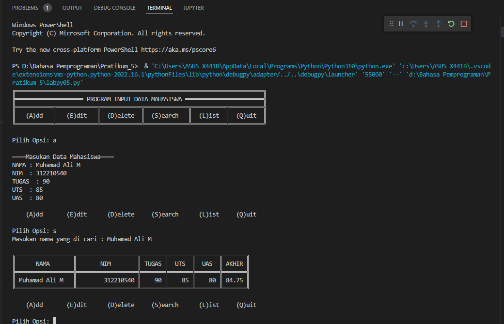

# PENJELASAN PRATIKUM_5 "DICTIONARY" PROGRAM INPUT NILAI

1.Deklarasi dictionary data

2.Input untuk pilih opsi

(A)dd (E)dit (D)elete (S)earch (L)ist (Q)uit

3.Jika Input A

    a.Input nama,nim,tugas,uts,uas

    b.Nilai akhir perpaduan nilai tugas,uts,uas

    c.Jika nilai nim,tugas,uts,uas, kosong/tidak di isi dengan angka maka ValueError dan meminta input ulang

    d.semua data akan di tambahkan menjadi value dan key menggunakan nama

4.Jika Input E

    a.Input nama/key yg di cari

    b.Jika nama ada di data.keys

        > Input pembaruan data

        > Jika nilai nim,tugas,uts,uas, kosong/tidak di isi dengan angka maka ValueError dan meminta input ulang

        > Input akan menimpa data yang lama

    c.Jika tidak

        > Data tidak di temukan

5.Jika Input D

    a.Input nama/key yg di cari

    b.Jika nama ada di data.keys

    c.Maka datanya akan di hapus

    d.Jika tidak

        > Data tidak di temukan

6.Jika Input S

    a.Input nama/key yg di cari

    b.Jika nama ada di data.keys

        - Print nama,nim,uts,tugas,akhir

    c.Data tidak di temukan

7.Jika Input L

    a.Print data.values / memanggil semua values

8.Jika Input Q

    a.Program Berhenti

9.Jika Input diluar, A,E,D,S,L,Q

    a.Pilih opsi yang tersedia

